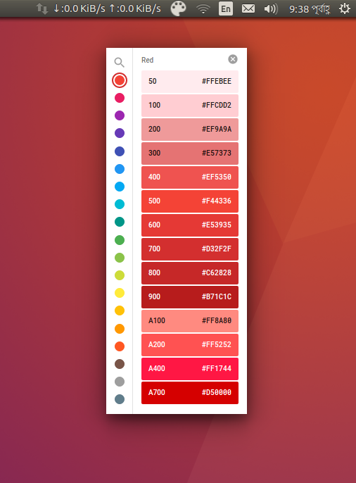

# Material Colors for Linux (Ubuntu)

A handy little Cross-Platform app that gives you quick access to the standard material design color palette.



**[Download for Mac](https://github.com/romannurik/MaterialColorsApp/releases)** - 
**[Download for Linux](https://github.com/greenitsolution/MaterialColorsApp/releases)**

## Build instructions

If you want to customize the app for your own needs, you can do a custom build.

  1. First install [Node.js](https://nodejs.org/) and [npm](https://www.npmjs.com/).
  2. Clone the repository and in the root directory, run:
     ```
     $ npm install
     ```
  3. To run the app:
     ```
     $ npm start
     ```

Note that you'll probably want to disable the auto-updating mechanism by emptying out the `checkForUpdates` method in
[main.js](https://github.com/romannurik/MaterialColorsApp/blob/master/app/main.js).
